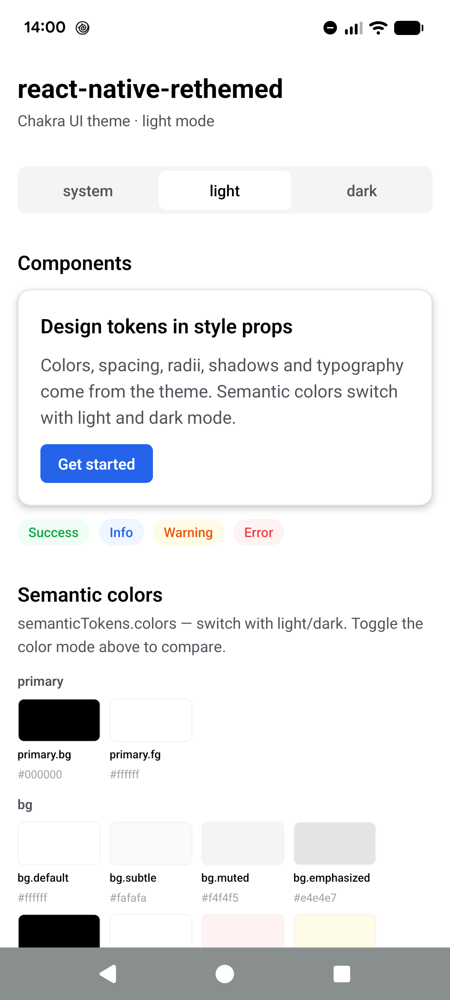
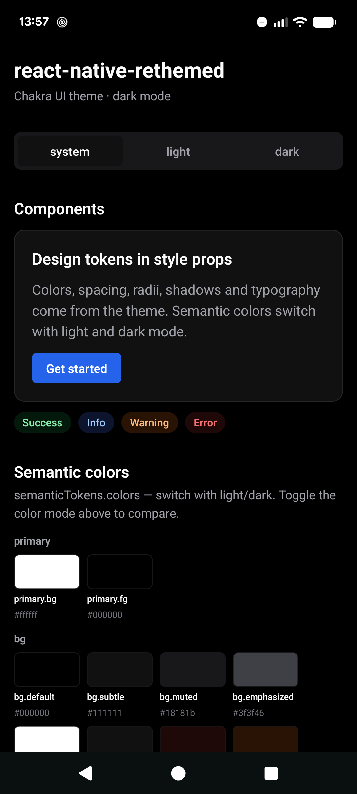

# react-native-rethemed

[](LICENSE) [](https://www.typescriptlang.org/) [](https://reactnative.dev/)

Design tokens for React Native style props — no wrapper components. Typed by codegen, light/dark aware, with token packages for Chakra UI, Material UI, Material Design 3, Panda CSS, Tailwind CSS, shadcn/ui and more.

<p align="center">
  
  &nbsp;&nbsp;
  
</p>

## ✨ Features

- **🔒 Fully Typed**: Codegen turns your theme into exact TypeScript types. Unknown tokens and raw colors are compile errors, and editor hovers show each token's value
- **🧩 No Wrapper Components**: Keep using `View`, `Text`, `Image`, `Pressable` or any third-party component — `themed.view()` returns a plain style object
- **🪶 Lightweight**: No runtime dependencies besides `react` and `react-native`. No native code, no Babel plugin
- **📱 Works Everywhere**: Drop into any React Native app, Expo or bare, new or existing
- **🌗 Light / Dark Mode**: Semantic colors switch with the color scheme. Follow the OS, let users choose (with persistence), or drive it from your own state
- **🪝 Hooks API**: `useThemed()` for styles and tokens, `useColorMode()` for switching modes
- **🎨 Your Own Design System**: Define colors, spacing, radii, typography, shadows, z-indices and text presets
- **📦 Extend Popular Design Systems**: Start from Chakra UI, Material UI, Material Design 3, Panda CSS, Tailwind CSS or shadcn/ui tokens and override what you need with `extendTheme`
- **⚡ Fast**: Themes are resolved once per color scheme, and `themed` stays referentially stable until the scheme changes
- **🤖 AI-Agent Friendly**: Optionally generate a Markdown token reference so coding agents use your tokens instead of hard-coded values

## 🚀 Example

```tsx
import { Text, View } from 'react-native';
import { useThemed } from './theme/themed.gen';

export function Card() {
  const { themed } = useThemed();

  return (
    <View
      style={themed.view({
        backgroundColor: 'bg.panel', // switches with light/dark
        borderRadius: 'lg',
        padding: 4,
        gap: 2,
        shadow: 'md',
      })}
    >
      <Text style={themed.text.title.md({ color: 'fg.default' })}>Title</Text>
      <Text style={themed.text({ color: 'fg.muted', fontSize: 'sm' })}>
        Colors, spacing, radii, shadows and typography come from the theme.
      </Text>
    </View>
  );
}
```

## 📦 Packages

| Package | Description |
| --- | --- |
| [`@react-native-rethemed/core`](packages/react-native-rethemed/core) | Runtime: `defineTheme`, `extendTheme`, `createThemed` |
| [`@react-native-rethemed/cli`](packages/react-native-rethemed/cli) | `@react-native-rethemed/cli codegen` — generates typed bindings from a theme |
| [`@react-native-rethemed/chakra-ui-tokens`](packages/react-native-rethemed/chakra-ui) | Chakra UI colors (with light/dark semantic colors), radii, spacing, typography, shadows, z-indices |
| [`@react-native-rethemed/material-ui-tokens`](packages/react-native-rethemed/material-ui) | Material UI's default theme (Material Design 2): light/dark palette, color palette, typography variants, spacing, shape, elevations 0–24, z-indices |
| [`@react-native-rethemed/material-design-tokens`](packages/react-native-rethemed/material-design) | Material Design 3 type scale and spacing |
| [`@react-native-rethemed/panda-css-tokens`](packages/react-native-rethemed/panda-css) | Panda CSS colors, radii, spacing, typography, shadows |
| [`@react-native-rethemed/tailwind-css-tokens`](packages/react-native-rethemed/tailwind-css) | Tailwind CSS `theme.css` with Tailwind's names: colors, spacing (`padding: 4` = `p-4`), radii, `text-*` presets with paired line heights, font weights, leading, tracking, shadows. The palette, radii and shadows match Panda CSS, whose preset uses Tailwind's |
| [`@react-native-rethemed/shadcn-ui-tokens`](packages/react-native-rethemed/shadcn-ui) | shadcn/ui: Tailwind CSS plus shadcn/ui's light/dark semantic colors named like the class names (`'primary'`, `'primary-foreground'`), seven base colors and the `--radius` scale |

## 🛠️ Setup

### Installation

```sh
npm install @react-native-rethemed/core
npm install --save-dev @react-native-rethemed/cli
```

Add a token package if you want to start from an existing design system:

```sh
npm install @react-native-rethemed/chakra-ui-tokens
# or @react-native-rethemed/material-ui-tokens, @react-native-rethemed/material-design-tokens,
#    @react-native-rethemed/panda-css-tokens, @react-native-rethemed/tailwind-css-tokens,
#    @react-native-rethemed/shadcn-ui-tokens
```

`react` and `react-native` are peer dependencies.

### Define a theme

Create a theme file and export the config.

```ts
// src/theme/theme.ts
import { defineTheme } from '@react-native-rethemed/core';

export const themeConfig = defineTheme({
  tokens: {
    colors: { white: '#ffffff', 'gray.950': '#111111' },
    radii: { none: 0, md: 6, full: 9999 },
    spacing: { 0: 0, 1: 4, 2: 8, 4: 16 },
    fontSizes: { sm: 14, md: 16, lg: 18 },
    fontWeights: { normal: '400', semibold: '600' },
    lineHeights: { short: 1.375, moderate: 1.5 },
  },
  semanticTokens: {
    colors: {
      bg: {
        default: { light: '#ffffff', dark: '#111111' },
      },
      fg: {
        default: { light: '#111111', dark: '#fafafa' },
        muted: { light: '#52525b', dark: '#a1a1aa' },
      },
    },
    text: {
      title: {
        md: { fontSize: 'md', lineHeight: 'moderate', fontWeight: 'semibold' },
      },
    },
  },
  defaults: { fontSize: 'md' },
});
```

Or start from a token package:

```ts
import { extendTheme } from '@react-native-rethemed/core';
import { chakraUiTheme } from '@react-native-rethemed/chakra-ui-tokens';
import { materialDesignTheme } from '@react-native-rethemed/material-design-tokens';

// Chakra UI colors, radii and spacing + Material Design 3 text presets
export const themeConfig = extendTheme(materialDesignTheme, chakraUiTheme);
```

Token packages also export their primitive values (`colors`, `spacing`, `radii`, …), so you can build your own semantic tokens from a design system's palette:

```ts
import { extendTheme } from '@react-native-rethemed/core';
import { chakraUiTheme, colors } from '@react-native-rethemed/chakra-ui-tokens';

export const themeConfig = extendTheme(chakraUiTheme, {
  semanticTokens: {
    colors: {
      primary: {
        bg: { light: colors['gray.950'], dark: colors.white },
        fg: { light: colors.white, dark: colors['gray.950'] },
      },
      bg: {
        default: { light: colors.white, dark: colors['gray.950'] },
      },
    },
  },
});
```

### Generate typed bindings

```sh
npx @react-native-rethemed/cli codegen src/theme/theme.ts --docs docs/themed.md
```

This writes `src/theme/themed.gen.ts` next to the theme file. It contains the token types and a ready-to-use instance. Every token-aware prop carries a JSDoc table of its tokens and values, so editor hovers and autocomplete show exactly what the theme defines.

An excerpt of what the theme above generates:

```ts
// src/theme/themed.gen.ts
// Code generated by @react-native-rethemed/cli. DO NOT EDIT.

export type SemanticColorToken = 'bg.default' | 'fg.default' | 'fg.muted';
export type PrimitiveColorToken = 'white' | 'gray.950';
/** Color props take both: semantic colors switch with light/dark, primitives are fixed. */
export type ColorToken = SemanticColorToken | PrimitiveColorToken;
export type RadiusToken = 'none' | 'md' | 'full';
export type SpacingToken = 0 | 1 | 2 | 4;
export type FontSizeToken = 'sm' | 'md' | 'lg';
export type LineHeightToken = 'short' | 'moderate';

export interface ThemedStyleProps {
  /**
   * `semanticTokens.colors`: switch with light/dark. Prefer these.
   *
   * | token | light | dark |
   * |:--|:--|:--|
   * | `bg.default` | #ffffff | #111111 |
   * | `fg.default` | #111111 | #fafafa |
   * | `fg.muted` | #52525b | #a1a1aa |
   *
   * `tokens.colors`: Fixed colors, the same in light and dark.
   *
   * | token | value |
   * |:--|:--|
   * | `white` | #ffffff |
   * | `gray.950` | #111111 |
   */
  backgroundColor?: ColorToken;
  /**
   * `tokens.radii`
   *
   * | token | value |
   * |:--|--:|
   * | `none` | 0 |
   * | `md` | 6 |
   * | `full` | 9999 |
   */
  borderRadius?: RadiusToken;
  /**
   * `tokens.spacing`
   *
   * | token | value |
   * |:--|--:|
   * | `0` | 0 |
   * | `1` | 4 |
   * | `2` | 8 |
   * | `4` | 16 |
   */
  padding?: SpacingToken | 'auto' | `${number}%`;
  /**
   * Ratios of `fontSize`: a token resolves to `fontSize × ratio`, using the style's own `fontSize` or else the default font size, `md` (16). A raw number is an absolute line height.
   *
   * `tokens.lineHeights`
   *
   * | token | value |
   * |:--|--:|
   * | `short` | ×1.375 |
   * | `moderate` | ×1.5 |
   */
  lineHeight?: LineHeightToken | number;
  // ...every other color, radius, spacing and typography prop
}

export interface ThemedTextVariants {
  title: {
    /**
     * `semanticTokens.text.title.md`
     *
     * | fontSize | lineHeight | letterSpacing | fontWeight |
     * |--:|--:|--:|--:|
     * | `md` (16) | `moderate` (×1.5 → 24) | – | `semibold` (600) |
     */
    md: TextVariant;
  };
}

export interface ThemedSemanticTokens {
  /** Resolved for the current color scheme. */
  colors: {
    fg: {
      /**
       * | light | dark |
       * |:--|:--|
       * | #111111 | #fafafa |
       */
      default: string;
      // ...
    };
  };
  // ...
}

export const { ThemedProvider, useThemed, useColorMode } =
  createThemed<ThemedTypes>(themeConfig);
```

Re-run the command whenever the theme changes. We recommend adding it as a script and running it from `prepare`, so the bindings are regenerated on every install:

```json
{
  "scripts": {
    "theme:codegen": "@react-native-rethemed/cli codegen src/theme/theme.ts --docs docs/themed.md",
    "prepare": "npm run theme:codegen"
  }
}
```

#### 🤖 Token reference for AI agents

With `--docs`, the CLI also writes a Markdown file (`docs/themed.md` above) for AI coding agents. It lists every token with its light/dark values, every text preset, and the rules for using them: always go through `themed.*()`, prefer semantic colors, never hard-code colors or spacing, and so on. With it, an agent writes `themed.view({ backgroundColor: 'bg.default' })` instead of `{ backgroundColor: '#fff' }`.

```md
<!-- docs/themed.md (generated) -->
# Theme tokens

The design tokens of this app's theme (`src/theme/theme.ts`) and how to use them with react-native-rethemed. Always use these tokens instead of hard-coded colors, radii and spacing.

## Semantic colors

Use as `'<group>.<token>'` on `color`, `backgroundColor`, `border*Color`, `tintColor`, …

### fg

| token | light | dark |
|:--|:--|:--|
| `fg.default` | #111111 | #fafafa |
| `fg.muted` | #52525b | #a1a1aa |
...
```

> [!TIP]
> Reference the generated file from your project's `DESIGN.md`, so agents read it before writing any UI:
>
> ```md
> <!-- DESIGN.md -->
> ## Styling
>
> Style components with react-native-rethemed. Before writing or changing any style,
> read [docs/themed.md](docs/themed.md): it lists every design token and the rules for using them.
> ```

### Set up `ThemedProvider`

Wrap your app with the generated `ThemedProvider`. There are two modes, depending on whether your app already manages the color scheme.

#### Without an existing color scheme (uncontrolled)

`ThemedProvider` owns the color mode. It follows the OS by default, and `useColorMode()` lets the user switch between `'light'`, `'dark'` and `'system'`.

```tsx
import { ThemedProvider } from './theme/themed.gen';

export default function App() {
  return (
    <ThemedProvider>
      <Root />
    </ThemedProvider>
  );
}
```

To persist the user's choice, pass a `storage`. Anything with `getItem` / `setItem` works (sync or async), such as `AsyncStorage` or `expo-secure-store`:

```tsx
import AsyncStorage from '@react-native-async-storage/async-storage';

<ThemedProvider defaultColorMode="system" storage={AsyncStorage}>
  <Root />
</ThemedProvider>;
```

| Prop | Type | Default | Description |
| --- | --- | --- | --- |
| `defaultColorMode` | `'light' \| 'dark' \| 'system'` | `'system'` | Initial mode before anything is restored from storage |
| `storage` | `{ getItem, setItem }` | — | Where the selected mode is persisted |
| `storageKey` | `string` | `'react-native-rethemed.color-mode'` | Storage key |

In this mode the provider also calls `Appearance.setColorScheme()`, so native UI (alerts, keyboards, date pickers) follows the selected mode.

#### With an existing color scheme (controlled)

If your app already decides the color scheme (React Navigation, Expo Router, your own store, …), pass it as `colorScheme`. The provider uses it as-is and ignores `defaultColorMode` / `storage`.

```tsx
import { useColorScheme } from 'react-native';
import { ThemedProvider } from './theme/themed.gen';

export default function App() {
  const scheme = useColorScheme(); // or your app's own state

  return (
    <ThemedProvider colorScheme={scheme === 'dark' ? 'dark' : 'light'}>
      <Root />
    </ThemedProvider>
  );
}
```

In controlled mode, change the scheme by updating the prop. `useColorMode().setMode()` only logs a warning in development.

## 📖 Usage

### `useThemed`

`useThemed()` returns the theme for the current color scheme. Call it inside a component under `ThemedProvider`; it re-renders when the scheme changes.

```ts
const { themed, semanticTokens, tokens, colorScheme } = useThemed();
```

| Field | Description |
| --- | --- |
| `themed` | Style functions: `themed.view()`, `themed.text()`, `themed.image()` |
| `semanticTokens` | Semantic tokens, with colors resolved for the current scheme |
| `tokens` | Primitive tokens, exactly as in the config |
| `colorScheme` | The current scheme: `'light'` or `'dark'` |

### `themed`

Each function takes a React Native style with token names and returns a plain style object. Props that have no tokens (`flex`, `width`, `position`, …) pass through unchanged.

#### View

`themed.view()` returns a `ViewStyle`. Use it for `View`, `Pressable`, `ScrollView`, or any component that takes a view style.

```tsx
<View
  style={themed.view({
    flex: 1,
    backgroundColor: 'bg.default',
    borderColor: 'border.default',
    borderWidth: 1,
    borderRadius: 'lg',
    paddingHorizontal: 4,
    gap: 2,
    shadow: 'md',
    zIndex: 'docked',
  })}
/>
```

#### Text

`themed.text()` returns a `TextStyle`.

```tsx
<Text
  style={themed.text({
    color: 'fg.default',
    fontSize: 'xl',
    fontWeight: 'semibold',
    lineHeight: 'short',
    letterSpacing: 'tight',
  })}
>
  Hello
</Text>
```

Text presets from `semanticTokens.text` are available as `themed.text.<path>()`. Pass an override to add or change props:

```tsx
<Text style={themed.text.title.md()}>Title</Text>
<Text style={themed.text.body.md({ color: 'fg.muted' })}>Body</Text>
```

When a preset's line height is a token, overriding `fontSize` recomputes it. When the preset has an absolute line height, pass `lineHeight` together with `fontSize`.

#### Image

`themed.image()` returns an `ImageStyle`.

```tsx
<Image
  source={avatar}
  style={themed.image({ width: 40, height: 40, borderRadius: 'full' })}
/>
<Image source={icon} style={themed.image({ tintColor: 'fg.muted' })} />
```

#### Type safety

With the generated types, invalid tokens fail to compile:

```ts
themed.view({ backgroundColor: '#ffffff' }); // ✗ colors are token-only
themed.view({ padding: 13 });                // ✗ unknown spacing token
themed.view({ color: 'fg.default' });        // ✗ `color` is not a View style
themed.text.title.lg();                      // ✗ unknown text preset
```

For a genuine one-off raw value, combine with a plain style object:

```tsx
<View style={[themed.view({ padding: 4 }), { backgroundColor: overlayColor }]} />
```

#### Performance

Calling `themed.*()` inline on every render is fine: React Native compares `style` by value, and a call is very cheap. Memoize with `useMemo(() => themed.view({ ... }), [themed])` only when the style needs a stable reference (passed to a `React.memo` component, used as `contentContainerStyle`, or as a hook dependency). `themed` itself only changes when the color scheme does.

### `semanticTokens`

Use `semanticTokens` for values outside `style`, such as an icon's `color` prop. Colors are already resolved for the current scheme.

```tsx
const { semanticTokens } = useThemed();

<ActivityIndicator color={semanticTokens.colors.fg.muted} />
<TextInput placeholderTextColor={semanticTokens.colors.fg.subtle} />
<Icon name="check" color={semanticTokens.colors.fg.success} />
```

Text presets are available as `semanticTokens.text.<path>`, with their `color` resolved too.

### `tokens`

`tokens` holds the primitive values exactly as defined in the theme, for places where you need the raw number or color.

```tsx
const { tokens } = useThemed();

<FlatList
  data={items}
  contentContainerStyle={{ padding: tokens.spacing[4] }}
  renderItem={renderItem}
/>
<StatusBar backgroundColor={tokens.colors['gray.950']} />
```

### `useColorMode`

`useColorMode()` reads and changes the color mode in uncontrolled mode.

```tsx
import { useColorMode } from './theme/themed.gen';

function ColorModeSwitch() {
  const { mode, setMode } = useColorMode();

  return (
    <SegmentedControl
      values={['system', 'light', 'dark']}
      selectedIndex={['system', 'light', 'dark'].indexOf(mode)}
      onChange={(e) => setMode(e.nativeEvent.value)}
    />
  );
}
```

| Field | Description |
| --- | --- |
| `mode` | `'light'`, `'dark'` or `'system'` |
| `setMode` | Changes the mode, and saves it when `storage` is set |

## 🎨 Defining Tokens

A theme has two layers, following Chakra UI's distinction:

- **`tokens`** — primitive values that are the same in light and dark.
- **`semanticTokens`** — role-named values built on top of them: light/dark colors and text presets.

### `tokens`

Each category maps token names to values, and is used by the matching style props.

| Category | Used by | Example |
| --- | --- | --- |
| `colors` | `color`, `backgroundColor`, `border*Color`, `tintColor`, `shadowColor`, … | `{ white: '#ffffff', 'red.500': '#ef4444' }` |
| `radii` | `borderRadius` and every corner variant | `{ sm: 4, md: 6, full: 9999 }` |
| `spacing` | `padding*`, `margin*`, `gap`, `rowGap`, `columnGap` | `{ 0: 0, 1: 4, 2: 8, 4: 16 }` |
| `fontSizes` | `fontSize` | `{ sm: 14, md: 16, lg: 18 }` |
| `fontWeights` | `fontWeight` | `{ normal: '400', bold: '700' }` |
| `lineHeights` | `lineHeight` | `{ short: 1.375, tall: 1.625 }` |
| `letterSpacings` | `letterSpacing` | `{ tight: -0.4, wide: 0.4 }` |
| `zIndices` | `zIndex` | `{ dropdown: 1000, modal: 1400 }` |
| `shadows` | the virtual `shadow` prop | see below |

A few details:

- **Spacing keys** can be numbers: `spacing: { 4: 16 }` is used as `padding: 4`. `'auto'` and percentages are accepted too.
- **Line heights are ratios of `fontSize`**, like unitless CSS line-height. `themed.text({ fontSize: 'lg', lineHeight: 'short' })` resolves to `{ fontSize: 18, lineHeight: 24.75 }`. When the style has no `fontSize`, `defaults.fontSize` is used (React Native's default of 14 if unset). A raw number stays absolute.
- **Shadows** are presets of React Native shadow props. `shadow: 'sm'` expands to all of them, including Android's `elevation`:

  ```ts
  shadows: {
    sm: {
      shadowColor: '#000000',
      shadowOffset: { width: 0, height: 1 },
      shadowOpacity: 0.1,
      shadowRadius: 2,
      elevation: 2,
    },
  },
  ```

- Typography props (`fontSize`, `fontWeight`, `lineHeight`, `letterSpacing`) and `zIndex` accept a token or a raw value. Colors, radii and spacing are **token-only**.

### `semanticTokens`

#### Colors

Colors are grouped as `group → token → { light, dark }` and used as `'group.token'`. They switch with the current color scheme.

```ts
semanticTokens: {
  colors: {
    bg: {
      default: { light: '#ffffff', dark: '#111111' },
      subtle: { light: '#fafafa', dark: '#18181b' },
    },
    fg: {
      default: { light: '#111111', dark: '#fafafa' },
    },
  },
},
```

```ts
themed.view({ backgroundColor: 'bg.subtle' });
```

Colors can also sit at the top level, without a group, and are then used by their bare name — the way shadcn/ui names them:

```ts
semanticTokens: {
  colors: {
    primary: { light: '#171717', dark: '#e5e5e5' },
    'primary-foreground': { light: '#fafafa', dark: '#171717' },
  },
},
```

```ts
themed.view({ backgroundColor: 'primary' });
themed.text({ color: 'primary-foreground' });
```

Primitive `tokens.colors` are accepted by the same props, but they never change with the scheme. Prefer semantic colors for anything that should. If a name exists in both, the semantic color wins.

#### Text presets

`semanticTokens.text` is a tree of typography presets of any depth. Each field references a `tokens` key or takes a raw value. A preset is called by its path: `themed.text.<path>(override?)`.

```ts
semanticTokens: {
  text: {
    // role → size (Material Design 3 style): themed.text.title.md()
    title: {
      md: { fontSize: 'md', lineHeight: 'moderate', fontWeight: 'semibold' },
      sm: { fontSize: 14, lineHeight: 20, fontWeight: '500' },
    },
    // flat: themed.text.caption()
    caption: {
      fontSize: 'sm',
      letterSpacing: 'wide',
      color: { light: '#71717a', dark: '#a1a1aa' }, // optional, per scheme
    },
    // deeper: themed.text.heading.display.lg()
    heading: {
      display: { lg: { fontSize: 36, lineHeight: 44, fontWeight: 'semibold' } },
    },
  },
},
```

`color` is optional. It can be a single color, or one per scheme (`{ light, dark }`). When a scheme is left out, the preset sets no color for it.

`textTransform` is optional too (`'uppercase'`, `'lowercase'`, `'capitalize'` or `'none'`), e.g. Material UI's `button` and `overline` presets.

### `extendTheme`

`extendTheme(...themes)` merges theme configs from left to right. Later themes override earlier ones per key, so you can combine token packages and add your own tokens on top.

```ts
import { extendTheme } from '@react-native-rethemed/core';
import { chakraUiTheme } from '@react-native-rethemed/chakra-ui-tokens';
import { materialDesignTheme } from '@react-native-rethemed/material-design-tokens';

export const themeConfig = extendTheme(materialDesignTheme, chakraUiTheme, {
  tokens: {
    colors: { brand: '#6d28d9' },
  },
  semanticTokens: {
    colors: {
      bg: { default: { light: '#fdfcff', dark: '#0c0a12' } },
    },
    text: {
      display: { lg: { fontSize: 60, lineHeight: 68 } },
    },
  },
});
```

How each part is merged:

| Part | Merge |
| --- | --- |
| `tokens.<category>` | Per token name. Other names in the category are kept. |
| `semanticTokens.colors` | Per group, then per token. Overriding `bg.default` keeps `bg.subtle` and every other group. |
| `semanticTokens.text` | Groups merge recursively; a preset is replaced whole. Overriding `display.lg` keeps `display.md`. |
| `defaults` | Per key. |

A partial theme may reference tokens that another theme supplies; the CLI validates references against the final, merged config.

## ⌨️ CLI

```
Usage: @react-native-rethemed/cli codegen <theme-file> [options]

Options:
  -o, --out <file>      Output file (default: <theme-dir>/themed.gen.ts)
  -d, --docs <file>     Also write a Markdown token reference for AI
                        agents and humans (e.g. docs/themed.md)
  -e, --export <name>   Export holding the config (default: the default
                        export, or the only ThemeConfig-looking export)
      --core <module>   Core module specifier used by the generated file
                        (default: @react-native-rethemed/core)
  -h, --help            Show this help
```

The CLI validates the theme before writing (for example, a text preset that references a missing `fontSizes` key), and prints a summary of the generated tokens.

## 📄 License

MIT

Token packages include values converted from [Chakra UI](https://github.com/chakra-ui/chakra-ui) (MIT), [Material UI](https://github.com/mui/material-ui) (MIT), [Panda CSS](https://github.com/chakra-ui/panda) (MIT), [Tailwind CSS](https://github.com/tailwindlabs/tailwindcss) (MIT), [shadcn/ui](https://github.com/shadcn-ui/ui) (MIT) and the [Material Design 3](https://m3.material.io/) specification.
